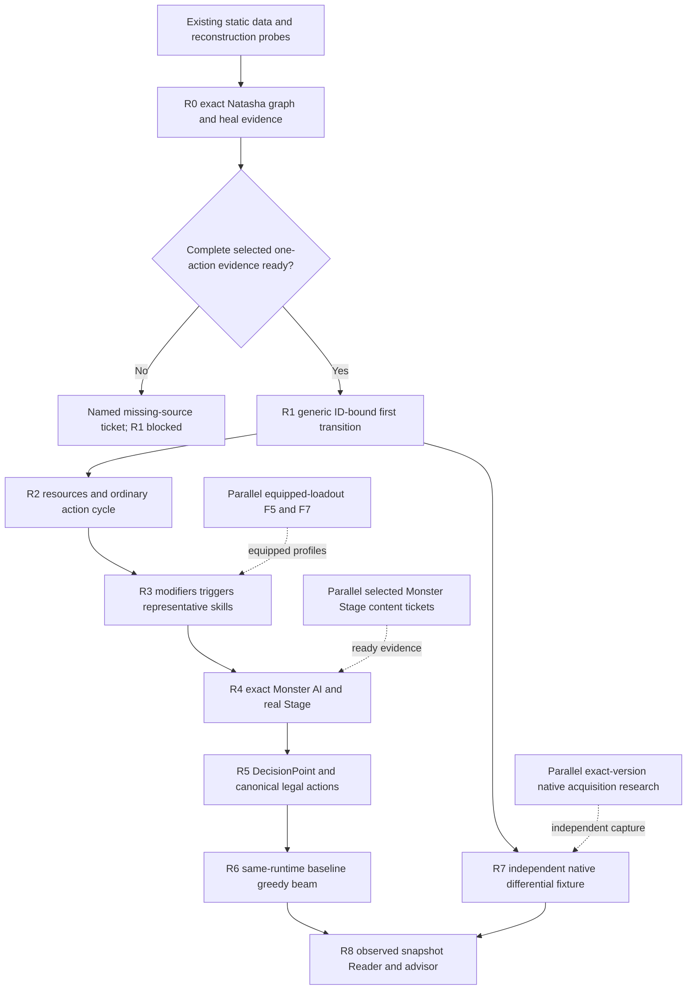

# Real runtime implementation dependencies — 4.4.54

Plan: `CR-REAL-RUNTIME-MASTER-PLAN-20260929-001` at HEAD `7eb82ec2400b050e6b915bbfb2d834bbfe0fae3d`, branch `terra/implementation`. These are future evidence gates, not delivered runtime capabilities.

**Tomorrow:** R0, `CR-REAL-RUNTIME-NATASHA-EVIDENCE-CLOSURE-20260929-001`. Reproduce exact Natasha content, reconcile the full invocation graph, resolve actual parameters/context and recover the positive HealData consumer. Do not implement a BattleState executor first.

**Target:** 1105 / 110502 -> real EntryAbility -> generic operations -> deterministic HP-changing BattleState transition in R1. The existing Phase02 request-only test does not satisfy it.

| Phase | Hard entry gate | Exit evidence / what it unlocks |
|---|---|---|
| R0 evidence closure | Pinned selected archive/registry/binary provenance; read dirty evidence | Full selected action inventory, parameter/target/consumer/order/completion proof and coding-ready manifest, or explicit blockers. No HP mutation or capability promotion. |
| R1 first transition | R0 complete one-action profile; narrow actor/skill/HP initialization validation | One real ID-bound complete invocation changes HP; exact cloned/repeated/replayed state and trace; atomic rejection. Scoped reference capability only. |
| R2 ordinary cycle | R1; exact SP/energy/HP/toughness and recharge rules for accepted subset | Complete supported player turn with derived next delay and bounded forced events; general damage remains conditional on new evidence. |
| R3 modifiers/triggers | R2 and exact required definitions/activation contracts | Three representative Avatar skill identities/mechanisms; ordered lifecycle/continuation and multi-turn replay. |
| R4 Monster/Stage | R3; entity-exact Monster skill/AI and selected Stage graph/rules/Buffs | Real opposing turn/round and one fully launchable simple real Stage. Local encounter harness alone does not close this gate. |
| R5 decisions/actions | R2 context plus R3/R4 supported encounter | Runtime-produced decisions and canonical legal actions with declared completeness, resources and target constraints. |
| R6 planner | R5; clone/hash/terminal/objective/bounded transition; reviewed capability | Shared runtime manual/baseline/greedy/beam recommendation replay; versioned M15 reference admission, old v1 denial retained. |
| R7 native oracle | Independent exact-version capture; R1 trace for first comparison | Qualified observable-field match; native/golden promotion only within observed scope. Access failure leaves reference work intact. |
| R8 Reader/advisor | Stable R5/R6 schemas, acquisition feasibility; R7 for native-correct scope | Actual observed state maps to internal snapshot/decision/advice; freshness/coverage checked; no game input. |

Critical paths:

- First transition: **R0 readiness -> R1**.
- Reference encounter planning: **R0 -> R1 -> R2 -> R3 -> R4 -> R5 -> R6**.
- Native-correct live advisor: previous path plus **R7 -> R8**, and an actual permitted battle-state acquisition source.

The R7 arrow from R1 means capture/first-skill comparison can proceed before planner completion. R7 qualification for later encounter/Reader scopes requires their corresponding runtime/profile and independent observations; one first-skill match does not validate all advice.

Safe parallel work: disjoint selected R0 predicate/operand/selector/consumer evidence; F7 slot alias and equipped-loadout hardening; selected modifier/MonsterSkill/AI/Stage tickets; native capture feasibility. Integration rechecks all source/manifest hashes. This graph does not authorize proactive subagents, client attach/loading or external messaging.

Loadout gate: validate only selected actor/progression/skill/initial values in R1. Six populated relic slots, equipment UI and global F5 completeness are not prerequisites. Equipped profiles require their exact contextual effects and F7 normalization first. F5 stays globally open until its separate broader contract is completed.

Stop rules:

- R0 graph/enum/branch mismatch or missing positive consumer: keep R1 blocked; preserve the request-only/no-mutation test.
- Unknown reachable effect/late continuation: reject the whole action before publication. No executable prefix counted as a full skill.
- Wait parser/counterfactual barrier: no scheduling support without wakeup/order evidence or an explicit proved headless reference policy.
- M13/M14 facts change only after reviewed closure and replay. M15 v1 remains REJECTED; positive v2 waits for R6 gates. Native certificates are never forged for reference execution.
- Real Stage custom-string/empty condition or missing Buff/AI: return REAL_STAGE_LAUNCH_BLOCKED; do not invent default win rules.
- Native source unavailable: L1/L2 reference work may continue; native/golden claims remain blocked.
- Reader missing hidden state or stale observation: SnapshotBlocked or explicitly limited import; no guessed live state.

Backup: Fu Xuan 1208 / 120801, dormant behind damage-dispatch/SPHitRatio evidence gates. Current SPHitRatio frozen inputs still match and its artifact remains BLOCKED_BY_EVIDENCE. A primary-skill blocker does not authorize policy re-entry; no such investigation is scheduled.

Off the critical path: P2/P3 static products (maintenance); P4 support report and P5B bridge (extend only for required runtime documents); P5A static contract (freeze); M10/M11 old scopes (maintenance, limited search seam reuse); user-owned frontend visuals; full equipment completeness; 4.5.x migration; RL/MCTS; automatic control.

For per-CR authorities, likely files, schemas, tests, fail-closed conditions and the one ready-to-copy R0 prompt, use `real_runtime_master_plan_20260929_001.md`. Every implementation CR preserves existing dirt, forbids Git writes, and packages only its own files with reopened SHA-256 verification.
