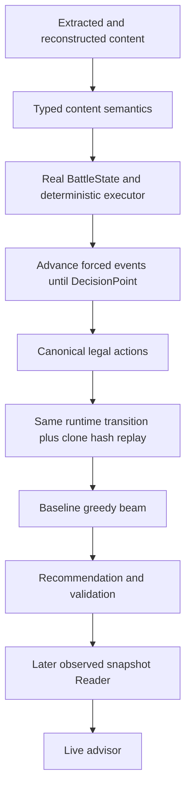
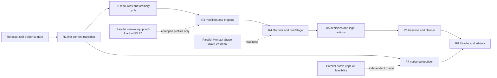

# Real Runtime Master Implementation Plan — 4.4.54

Request: `CR-REAL-RUNTIME-MASTER-PLAN-20260929-001`. Repository: `D:\HSR_Battle_Agent\hsr-battle-agent`. This is a source-reviewed architecture and implementation plan. It implements no runtime, modifies no tests, and performs no Git writes.

## 0. Start gate and plan status

| Recorded command | Result |
|---|---|
| `git rev-parse HEAD` | `7eb82ec2400b050e6b915bbfb2d834bbfe0fae3d` |
| `git branch --show-current` | `terra/implementation` |
| `git status --short` | Dirty; full initial output is embedded in the JSON companion |

Existing frontend, reverse-engineering, semantic evidence, tools and audit files are preserved. Git reported inaccessible `tmp8emg7ipj/` and `tmp98o9wqtg/`; neither was traversed or modified. The plan does not claim to have inspected their contents. No applicable AGENTS.md was found in the repository, its parent, drive root, or searched source/data/docs/tools trees. No delegation was used.

**Current verdict: C. REAL_RUNTIME_BLOCKED_BY_MISSING_RECONSTRUCTION.** State modelling is a second binding constraint. **Target milestone:** one content-originated 4.4.54 Avatar skill produces a deterministic BattleState transition. **Next implementation CR:** R0, exact Natasha action-graph reconciliation and positive-heal evidence closure. R0 has no BattleState executor deliverable. R1 is the first transition CR and is conditional on R0's readiness gate.

All future schemas, positive admission states, modules and acceptance targets below are proposals. None exists merely because it is named here. Dates in IDs identify this planning request, not promised delivery dates. Phases are gated by evidence, not estimates of calendar duration.

## 1. DS audit consumed and independent source checks

Both required DS artifacts were read completely: `data/control/real_runtime_reentry_audit_20260929_001.json` and `docs/agent/handoffs/real_runtime_reentry_audit_20260929_001.md`. The companion JSON records their byte hashes and the inspected source hashes.

Direct checks confirm 620 current M13 records, zero `CONTENT_ACTION_EXECUTABLE_REFERENCE` records, and compiler-report coverage of 29,086 `BEHAVIOR_AFFECTING_NODE_NOT_COMPILED` diagnostics. The compiler deliberately rejects a record containing any diagnostic. Its 1,528 executable reference **behavior records** are not 1,528 executable Avatar **skills**. M12's recorded full-action census has zero closed actions and a non-zero minimum residual. These are recorded corpus measurements, not a fresh complete-client census.

Source checks confirm that `real_skill.py` loads only a specific Phase02 subtree; `healing.py` emits requests without HP/dispel writes; the E2E test supplies predicate, target and dynamic values externally and asserts unchanged state hash. `state_v2.py` owns typed store containers but defines no real actor/resource lifecycle. `strict_executor.py` only supports its existing no-op contract. M15's outcome vocabulary is still `{REJECTED}`. The bridge advertises no battle or planner execution. Oracle qualification requires independent native provenance; zero native/golden fixtures remains the audited baseline.

Three architectural qualifications to DS's interpretations matter:

1. A scoped evidence CR is possible even though no existing bounded fix is **already proved** sufficient. R0 must discover and close dependencies; it cannot promise closure merely because its scope is bounded.
2. F5 is not an indivisible prerequisite. Exact actor/skill/initial-value validation is required for R1; six populated relic slots are not required for a declared unequipped scope.
3. A protocol-shaped adapter does not make M11 immediately pluggable. Its search/result/replay code hard-codes M10 session types, scope and evidence constants. R6 needs a carefully extracted search core or a new adapter-aware entrypoint, while preserving the old public contracts.

### Current-tree discrepancies that R0 must resolve

The close-version corpus places Natasha HealHP at Phase02 `ONSTART:4`, outside the `PointB1` dispel predicate, and names its formula `HealByHealerMaxHP`. The exact-archive artifact places a discriminator-1481 HealHP **inside** a discriminator-1960 predicate's two success children, with serialized FormulaType 4. Its saved formula implementation uses target missing HP. The binary list header reports **22 top-level OnStart tasks**, while the old corpus has 11 top-level Phase02 operations. Do not equate these graphs, enum labels, or branch reachability by name. The exact extraction is a bounded structural proof; reproducing its parsing and resolving the full parent/list boundaries is R0's first gate.

The DS JSON also identifies the Arlan row's avatar as `100801` while its Markdown uses `1008`; it is not selected. Sam's DS candidate row lists no packet extras, but the actual canonical request has `SPHitRatio`, `HitPosHeight`, `StanceValue` and `CanTriggerLastKill`. It is not an escape from damage evidence blockers. Candidate selection therefore uses actual payloads, not the census's simplified extra-field column.

### SPHitRatio decision

The targeted artifact is `BLOCKED_BY_EVIDENCE`; its recommendation forbids SOL policy re-entry from that result. All its frozen-hash checks still match the inspected working tree, including the dirty dispatch-resolution file. New/untracked damage topology and positive DirectChangeHP probes are discovery surfaces; they prove neither the request recipient/base/multiplicity/order nor a joined positive HealData consumer. The current dispatch artifact still says `PARTIAL_RESOLUTION_TARGET_UNRESOLVED`. No new evidence was found that changes the SPHitRatio conclusion. **No SPHitRatio investigation or policy relaxation is scheduled.** Any later reconsideration requires a new version/hash-qualified producer-to-consumer join or an independent observation resolving its stated questions, followed by a separate evidence review.

## 2. Original goal and authority boundaries



Product documents and transport support this chain. They cannot supply missing battle semantics. No visual UI design, automatic game input, RL, MCTS or 4.5.x migration is on this path.

Keep five **claim categories** distinct: STATIC_DATA, REFERENCE_MODEL, SANDBOX_EXTENSION, REAL_CONTENT_RECONSTRUCTED, NATIVE_EVIDENCED. The frozen executable evidence enums currently have four modes and do not contain STATIC_DATA or REAL_CONTENT_RECONSTRUCTED. Represent these two as separate content-origin/provenance metadata, not as new aliases inserted into the frozen evidence vocabulary. R1's honest label is **real-content-originated, source-reconstructed, REFERENCE_MODEL execution; native validation absent**. A local scheduling policy remains SANDBOX_EXTENSION. Static machine-code evidence does not qualify an independent native execution oracle.

Use Avatar-specific data and content IDs; execute operation families generically. Unknown nodes, selectors, formulas, activation edges or hooks produce explicit blockers. Planner and manual execution share one transition implementation. Native certificates, reference envelopes and unsupported records remain distinct types.

## 3. Principles and enforcement

| Principle | Concrete enforcement |
|---|---|
| Generic mechanisms | Dispatch by typed operation/primitive identity; no `if avatar_id == ...` in runtime settlement or scheduler |
| Source-bound claims | Every lowered operation carries artifact hash, version relation, source byte range/path, runtime profile and evidence mode |
| Determinism | State, instance allocator, complete RNG state, scheduler queue and policies enter canonical identity from R1 |
| One runtime for planning | Search calls the same session transition as manual actions; no planner-only damage model |
| Fail closed | Preflight complete reachable action effect closure before publication; unknown late operations cannot leave partial state |
| Advisor first | Reader returns observations and uncertainty; no clicks, memory writes or input automation |
| User-owned UX | Only runtime-required versioned documents and backend adapter surfaces may change |

Counterfactual removal of WaitAnimState or a packet blocker is never a capability result. An implementation with caller-supplied expected amounts is not the first milestone. Presentation omission requires evidence for the operation and its ordering/RNG consequences.

## 4. Architecture reuse decisions

| Component | Disposition | Reason and intended seam |
|---|---|---|
| ContentDatabase | REUSED AS-IS, EXTENDED when needed | Stable versioned identity/provenance query; add typed MonsterSkill/Variant accessors in R4 only when exact joins need them. Do not execute from product projections. |
| ContentProductService | REUSED AS-IS | Read-only static projection and M14 reporting; not actor initialization authority. |
| ScenarioCompiler | REUSED AS-IS; WRAPPED | Keep static assembly and existing hashes; runtime initializer separately validates carried fields. Extend narrow F5 validation only where backward-compatible or schema-versioned. |
| ScenarioPackage/2 | REUSED AS-IS | Input document, not executable certification. Snapshot initialization captures an immutable copy and package hash. |
| ScenarioSupportReporter | EXTEND WHEN REQUIRED | Preserve descriptive/non-effect contract; later show runtime profile/admission facts without running battles. |
| external_behavior / behavior compiler / Behavior IR | EXTENDED | Preserve canonical-only compilation and REJECT_NOT_NOOP; add exact-version selected extraction, typed provenance and lowering eligibility. Reconcile subtree differences before regeneration. |
| battle_ir descriptors | REUSED AS-IS | Representation inventory and unresolved handles; never dispatch descriptors by pretending `execution_permitted` is positive. |
| battle_ir executable values / PrimitiveCall / PrimitiveSpec | EXTENDED or WRAPPED | Reuse fixed-point/property/target/action types; introduce typed selected-skill binding and effect requests using current operation families. |
| TerraBattleState | EXTENDED via typed payload codecs and WRAPPED | Retain frozen store ownership, lossless serialization, allocator, revision/RNG and snapshots. Add a real-content profile view instead of another unrelated mutable state. |
| Legacy state and PrimitiveExecutor | WRAPPED for compatible pure helpers; DEFERRED as main aggregate | Existing helpers assume legacy property/timeline dictionaries. Port through explicit accessor interfaces as needed; no bidirectional legacy facade or two HP stores. Primitive dispatch pattern is reusable, not an automatic Terra execution path. |
| StrictExecutor / NativeContract / GateCertificate | REUSED AS-IS | Existing native requirements remain. Reference execution cannot obtain a fabricated native certificate. |
| ReferenceEvaluator | WRAPPED for verified static materialization; KEPT SEPARATE for amounts | Float-based level-80 external damage and external heal formulas do not prove the selected native-shaped heal request or ordering. Useful Level 2 comparators only within matching scope. |
| reference settlement / REF02 | REUSED AS-IS for reference fixtures | Exact caller packet contract and Decimal arithmetic remain; no synthetic envelope substitution for recovered skills. |
| M10 reference_sandbox | MAINTENANCE_ONLY, pattern reuse | Atomic publication, snapshot and replay patterns fit; local completion/resource/terminal rules and envelopes are not game rules. |
| M9 / M11 search | WRAPPED / narrowly EXTRACTED in R6 | Reuse bounded deterministic traversal, limits, ranking and replay logic; replace session-specific seams with a new scope entrypoint, not old evidence constants. |
| M13 registry / M14 content_support | EXTENDED after evidence gates | Descriptive safety facts retain versioned provenance; positive exact-profile capability is downstream of closure and replay. |
| M15 content_planner | EXTENDED in R6 only | Preserve v1 REJECTED-only API; introduce an explicit new reference admission contract after runtime/decision/search gates. No per-turn rules here. |
| Frontend bridge and adapter | EXTEND WHEN RUNTIME REQUIRES | Keep static routes and denial guards. New runtime routes/docs need explicit scope and new decoders; no visual work. |

Proposed dependency direction: `game_data` extraction/binding produces immutable typed programs; an outer `content_runtime` composition package consumes those programs, Terra snapshots and generic primitives. Low-level primitives consume typed state interfaces rather than importing content tables. Search consumes a session/transition adapter, not raw content. No quarantine-list deletion or strict-path import of `scenario_compiler`/`reference_execution` is authorized.

Existing `AtomicCommit` requires a native GateCertificate through TransactionPlan. Its publication algorithm is useful, but R1 must implement a **distinct reference-profile build-and-publish transaction** outside the strict native path. Reuse StagedTrace/TransactionRng/canonical values where their contracts fit; preserve all native preflight/certificate tests. Do not repurpose the synthetic SandboxResourceTransaction as authoritative SP settlement.

## 5. First target milestone and acceptance scope

**TM1: 1105 / 110502, a proved 4.4.54 Skill02 invocation, causes an actual HP increase through generic infrastructure.** Required chain:

`AvatarID -> SkillID -> exact owner SkillList/EntryAbility binding -> Phase01 -> activation/Phase02 -> typed predicate and DynamicFloat reads -> generic target resolution -> Heal request -> proved positive consumer -> CurrentHP mutation -> ordered trace -> reproducible Terra snapshot hash`.

R1 requires a pinned **one-action runtime profile** with an explicit supported progression/loadout/component/initial-state scope. Preflight covers every reachable behavior-affecting operation through that invocation's declared completion boundary, including resource writes, HOT installation and callbacks that fire during the action. All other branches must be demonstrably unreachable under validated inputs, not simply disabled. Unknown post-heal operations reject the entire transition. Future turn hooks can be stored as typed, source-bound programs and become a blocked boundary if execution support is unavailable; this is not a claim that a full future round executes.

Acceptance requires an injured living ally and source-resolved parameters; its CurrentHP changes, before/after hashes differ, cloned replay produces identical state/trace, and rejection publishes no changes to state, allocator, RNG or trace. Starting at Phase02 with caller bindings does not count. A formula-only result or a pending request does not count. If R0 cannot prove a healing branch is reachable for the chosen real loadout, TM1 is blocked; neither force the predicate true nor pick coefficients 1 and 50 from the old test.

Diagnostic graph prefixes may be inspected and traced separately, always labelled non-executable. They cannot satisfy TM1, M14 positive capability, M15 admission or planner validation. R1 does not claim a complete turn cycle, encounter, native correctness or planner readiness.

## 6. Selected skill, backup and unresolved dependencies

| Field | Primary |
|---|---|
| avatar_id / skill_id | `1105` / `110502` |
| Skill type | Skill02, healing combat skill; exact static type/cost/level row must be joined in R0 |
| EntryAbility | `Avatar_Natasha_00_Skill02_Phase01` in current registry/close-version owner config |
| Behavior roots | Phase01; Phase02; camera Self/Other siblings selected by ByIsTurnActionEntity; HOT modifier dependencies and their callbacks |
| Current M14 | FULL_ACTION_REPRESENTED; REPRESENTABLE_BLOCKED; SAFE_REFERENCE_MODEL_ONLY representation; STRICT_REJECT_UNTIL_NEW_EVIDENCE execution |
| Old census | 22 compiled closure operations, 3 rejected operations; MODIFIER, RANDOM_TARGET, REFERENCE_PACKET_OTHER, WAIT_ANIM_STATE; Phase01 structure-only, Phase02 rejected |
| Exact 4.4.54 evidence | Archive-bound Phase02 OnStart count 22; predicate 496 with key 12; success children DispelStatus 1199 then HealHP 1481; target discriminator 12; FormulaType 4; three unresolved DynamicFloat keys |
| Target | Selected ally via AbilityTargetEntity; Caster for performer/resource ownership; exact TargetInfo selector 16 and runtime selector join still needed |
| Settlement | Positive ordinary non-rally HealData consumption into authoritative HP; any dispel, SP and HOT effects in reachable closure must also be supported |

The **old comparison sequence**, not a proved 4.4.54 executable program, is: Phase01 invokes Phase02 and conditional camera; animation/movement; Phase02 waits .35 and .43, optional dispel at PointB1, independent heal, PointB3 lifetime update, HOT add, wait .53, ModifySPNew(AddRatio=1), random VO retarget and SkillPerformFinish. R0 replaces or explicitly version-qualifies this sequence after parsing the exact archive. The exact recovered subtree has `(predicate -> [dispel, heal])`, not that independent-heal structure.

Three serialized keys are `-2124210825` (dispel count), `-1544075911` (percentage), and `-203632277` (flat modification); opcodes are `[1,0,17]`. These are operand identities, not numeric values. Native-shaped FormulaType 4 in the current helper reads target MaxHP (1), CurrentHP (10), healer HealRatio (124), target HealTakenRatio (127). Its ordinary special factor is one only under the proved component branch.

Unresolved dependencies: exact static SkillID/owner/Phase01 join into the archive; full Phase01/Phase02 boundaries and enum/placement discrepancy; TriggerAbility activation/context/lifetime/barrier; PointB1/other predicates and progression binding; DynamicFloat opcode/hash parameter readers and skill-level values; target selector/TargetInfo context and ally legality; ordinary-healer/default constructor proof including absent fields; positive HealData event registration/dispatch/recipient/writer/clamping/event order; dispel consumer where reachable; HOT definition/installation/lifetime/properties/hooks; ModifySPNew resource meaning and owning team; random VO RNG topology/presentation omission; waits and completion; actor stat initialization and authoritative property defaults; post-action recharge (required for later turn cycle); absence of native oracle. No single current report proves this whole set closed.

**Why Natasha:** it has the strongest exact-archive structural anchor and existing native-shaped amount helper, with a named missing positive consumer. This offers a concrete generic evidence frontier. It is not the mechanically shortest complete action and not already executable. Selecting it does not assert that its full reconstruction will succeed in one CR.

**Backup: Fu Xuan basic attack, `1208 / 120801`, Skill01.** Entry `Avatar_FuXuan_00_Skill01_Phase01`; roots Phase02 and Camera. Actual source: camera and Phase02 invocations, LookAt/TriggerAnimState/TriggerEffect, waits, one Quantum `DamageByAttackProperty` request with `FormulaType=ByMaxHP`, dynamic percentage and stance, `SPHitRatio=1`, followed by DamagePerformFinish and SkillPerformFinish. Target is one selected enemy via AbilityTargetEntity; settlement ultimately HP/toughness plus any evidenced hit-resource effects. M14 FULL_ACTION_REPRESENTED / BLOCKED_BY_EVIDENCE / STRICT_REJECT_UNTIL_NEW_EVIDENCE; 11 closure operations, damage and wait blockers. It avoids HOT/modifier/random selection in the census. Missing exact-version root/operand/target/activation bindings, damage dispatch, SPHitRatio semantics, toughness/resource/completion and state initialization remain. **Dormant backup**, usable only after independently delivered new damage evidence closes those gates. A Natasha blocker does not authorize SPHitRatio re-entry or automatically switch CR scope.

## 7. Real BattleState V1

There are **no MUST_HAVE runtime state additions in first implementation CR R0**: it is evidence/tooling only. The table's first-runtime column means R1, not R0. Implement a typed `RealBattleStateView/1` profile over Terra's existing family ownership and typed row codecs; preserve `terra_battle_state/2` serialization. If an incompatible payload change becomes necessary, version the profile/row codecs and migrations explicitly, not the frozen family list casually.

| Component | MUST_HAVE_IN_FIRST_RUNTIME_CR (R1) | STRUCTURALLY_RESERVED | DEFERRED |
|---|---|---|---|
| Battle identity | content target, artifact manifest, runtime profile/rule/numeric IDs, scenario identity, revision/sequences | native observation identity | version migration |
| RNG | existing complete SandboxRng state + algorithm ID; zero draws only if closure proves none | typed stream roles and call-site ledger | native PRNG correspondence |
| Scheduler | active caster/action phase, invocation frame, ordered task/event work and continuation state; proved/local-policy barrier identity | ordinary timeline, interruptions and owner lanes | full special scheduler arbitration |
| Team resources | player team identity; SP before/delta/bounds if selected closure reads/writes it, otherwise explicit UNSUPPORTED | actor energy/max-energy typed resource records | special resources |
| Stage/wave | explicit free one-action scope; source stage absent, current fixture formation and local stop rule | wave index/spawn history, rules and terminal reason | real Stage rules/phase transitions |
| Actor identity | allocated instance ID, static ID/version/row hash, actor kind, team/side, slot | owner/summon relation | summons/body-part lifecycle |
| Progression | validated level, promotion, eidolon, skill level, trace activation/loadout provenance | contextual effect list | unsupported equipment/trace effects |
| HP | authoritative raw MaxHP and CurrentHP; alive view derived by selected profile; validation and effective heal delta | defeat/revival/locks policy records | special survival paths |
| Healing properties | evidenced raw HealRatio/HealTakenRatio and ordinary component classification | generic property entries/contribution sources | unknown default zeroing |
| Combat properties | only properties consumed by the selected action, stored once | attack/defense/speed/resistance/weakness maps | complete stat taxonomy |
| Toughness | typed unsupported/absent record when unused | current/max toughness and break state | mutation/break until R2 evidence |
| Energy | explicit unsupported status when unused | current/max energy, recharge rules | real energy mutation until R2 |
| Speed / AV | not required to manually invoke a validated active one-action context | property 32 speed, property 38 remaining delay; timeline order | reset/recharge until R2 |
| Status/modifier | exact selected HOT install/state/hooks if reachable; empty validated containers otherwise | generic instances, order, duration/count, properties | broad dispel/stack/lifecycle mechanics until R3 |
| Shield | proved absent under R1 profile | typed shield instances and source | shield settlement |
| Action state | actor availability, invocation/perform owner, target bindings, progress cursor and completion status | restriction/cooldown fields | unproved special action states |

Owners: entities/teams/formations for identities; properties for numeric HP/maxHP/speed/AV; survival for lifecycle/locks **without duplicating HP**; resources for SP/energy; modifier_instances/modifier_order for status; invocation_frames/behavior_instances/target_contexts/task_states/event_work for execution; scenario_runtime/terminal_state for scope/termination. Toughness has its separate family. Store validation defines uniqueness/cardinality; the generic TypedStore itself deliberately preserves duplicate/order data.

An unavailable property is not zero. An unsupported feature is not an inert default. Store explicit knowledge states, provenance and profile exclusions. Derived read views such as hp, speed, alive and targetable have one authoritative underlying value and revision-keyed caches.

## 8. Identity, clone and hash

Actor identity is a namespaced, generation-aware IdentityAllocator allocation, with static `(content_version, actor_kind, static_id)` separately recorded. Duplicate copies of an Avatar/Monster remain distinct. Allocate initial actors in canonical input formation order `(side_order, team_id, numeric slot)` after rejecting duplicate slots/instance IDs. Do not use OS pointers, display names or bare AvatarID as instance identity.

Preserve store/formation/queue ordering; sort mapping keys only for encoding. Queue order is explicit `(logical_time_raw, evidenced_phase_rank or declared policy rank, enqueue_sequence)`; source ordinal and parent event identify causality. Do not invent native priority by sorting actor IDs. Allocator counters, generations, pending reservations and tombstones serialize and clone.

`TerraBattleState.clone` and `TerraSnapshotV2` already copy through validated lossless serialization; reuse them. Typed payload accessors must not leak mutable containers. Immutable programs can be shared in memory only when restore still has self-contained content or a validated content-addressed manifest; hashes alone do not recreate definitions.

Use `semantic_hash_v2(TerraSnapshotV2)` as the **full replay identity**. It includes revision/sequences, allocator, complete RNG, stores, opaque data and policy identity; trace text/wall-clock timestamps remain outside gameplay state. SnapshotPolicyIdentity binds reference evidence, profile, rules and their hashes. Capture all future-affecting state, including pending frames, events and statuses. R1 rejection leaves revision, replay/effect sequences and hash unchanged; successful publication advances them through an explicit reference-profile transaction convention.

The existing revision-inclusive hash is not automatically a semantic transposition key: equal combat positions reached via different histories may hash differently. M11's current ACCOUNT_ONLY dedup is retained initially. Any later separate search-position projection must include all decision-affecting components, be proved equivalent for the profile, and must not change the existing hash contract or merge unresolved states.

## 9. Generic primitive layer and lowering

R0 represents typed contracts and proves eligibility; **it implements no runtime primitives**. In the table, CR1 execution means the first runtime implementation, R1. There is no alternate battle DSL: reuse the current operation families, preserve nested child order and source identities, and attach typed request/continuation payloads.

| Primitive family / existing operation | IR representation | Execution phase |
|---|---|---|
| Identity/target binding and property read | Existing EntityRef/TargetSet and target-intent data; add validated selector/context codec | R1: Caster and AbilityTargetEntity only as proved |
| DynamicFloat / SET_DYNAMIC_VALUE | Existing raw/formula definitions; typed parameter reader with operand provenance | R1 for exact selected opcode/reader subset; unknown opcode rejects |
| CONDITIONAL / PREDICATE | Preserve branch groups; explicit predicate input authority | R1 selected predicates only; no externally forced boolean in accepted path |
| INVOKE_BEHAVIOR / TriggerAbility | Named descriptor is insufficient; typed frame, owner, caller/callee, completion policy | R1 selected proved activation edge; broad/reentrant graph R3 |
| HEAL_REQUEST / HealHP | Generic request with formula/parameter/state/property provenance | R1 ordinary selected FormulaType and positive consumer |
| DISPEL_STATUS | Already structural; typed removal order/count/filter | R1 only if reachable and evidence closed; otherwise profile must prove unreachable or reject |
| ADD_MODIFIER / SET_DYNAMIC_VALUE lifetime | Existing catalog/instances plus exact installation and hook contract | R1 minimal selected HOT if required; general lifecycle R3 |
| MODIFY_TEAM_SP | Existing family, explicit team resource delta and clamp authority | R1 if selected closure requires it; general resource rules R2 |
| PRESENTATION_WAIT / completion markers | Typed barrier and performer/task lifetime; preserve ordering obligations | R1 selected wait/action completion; full ordinary scheduler R2 |
| DAMAGE_REQUEST / MODIFY_TOUGHNESS | Request descriptors exist, mixed fields still blocked | NEAR_TERM R2 only after new exact damage evidence; no SPHitRatio investigation scheduled |
| Energy read/write | Typed resource owner/value/bounds and source cost/recharge records | NEAR_TERM R2 |
| Remove/status stacks/properties/event emit | Existing modifier/property families; add event payload contracts | NEAR_TERM R3 |
| Trigger callbacks, on-hit and turn events | Invocation/event descriptors, stored ordered hooks | NEAR_TERM R3; unsupported firing blocks |
| All-team/adjacent/stored/retarget selectors | Existing target descriptors; exact resolution policy | NEAR_TERM R2/R3 as representative skills require |
| Shield, break, DOT, super break | Preserve representation and blockers | NEAR_TERM selectively after R2/R3 evidence; no batch promotion |
| Random target, summon/owner, formation change, loops and special scheduler | Representation with explicit unresolved contracts | DEFERRED until a dedicated profile closes semantics |

Presentation-only operations may be omitted by a narrowly proved headless policy with provenance and ordered trace markers. Mixed-state operations are not stripped of fields to fit a packet. Existing character-named boundary classes remain historical diagnostic compatibility; R1's accepted runtime uses generic HealConfig/SkillBinding/Program types, with Avatar-specific data only.

## 10. Target identity and resolution

Use `TargetResolutionContext` with caster instance, action's chosen target token, ability/skill target list, frame-local stored targets, owner/source and formation revision. Resolvers return an ordered tuple of validated actor instances plus selector identity, context revision and proof/profile ref. Target legality and target resolution are related but separate: a selected legal ally supplies an input, while the source selector decides how it is consumed.

R1 implements only Caster/self and a uniquely selected living ally through the proved AbilityTargetEntity selector, including its TargetInfo binding. Validate membership, side/team, alive/targetable restrictions, target cardinality and captured revision from source rules. Whether self is legal, whether dead actors can be healed, and absent AliveOnly defaults must be evidenced; no conventional game assumption fills a missing constructor/default.

Reserve selectors for single enemy, adjacent slots, all allies/enemies, random, summon/owner, stored and retargeted targets. Formation-slot order governs adjacency only after profile proof; random selection requires declared RNG stream and draw multiplicity. Frame-local alias changes never rewrite every pending event's target. Unknown selectors, missing context, invalidated handles or ambiguous ordering reject with a typed reason. Native target IDs and internal allocated IDs require a later explicit Reader mapping.

## 11. Settlement and numeric authority

Separate **request construction**, **amount calculation**, **state consumption** and **event publication**. R1 uses the source-reconstructed native-shaped FormulaType 4 helper only after R0 reconciles enum/branch/content identity. Inputs are caster/target IDs, source operation/ability frame, resolved percentage/modify raws, required property raws, ordinary/rally/component proof and request ordinal. Parameters come from the real skill's level/progression reader; they are never expected output values supplied by tests.

Current helper computes `(target.MaxHP - target.CurrentHP) * percentage + modify`, multiplied by `(1 + healer.HealRatio + target.HealTakenRatio)` and the ordinary special factor, then clamps non-positive amount to zero. This is its inspected scope, not a general Natasha gameplay claim. `ReferenceEvaluator.evaluate_heal` uses a different external formula/multiplier structure and cannot replace it by name.

The consumer must be recovered: exact HealData event kind/registration, recipient, amount field, alive/locks/overheal/clamp policy, property writer and emitted hooks. A candidate `min(maxHP, oldHP + amount)` is a **hypothesis to verify in R0**, not accepted native semantics. Do not reuse the negative-delta DirectDamageHP path for healing or infer a join from the positive helper's name/address. Effective heal delta and calculated amount are separate trace fields.

Use recovered fixed-point raw integer add/multiply/compare behavior and numeric-profile hash; preserve saturation/truncation and signed/raw representation at each step. Current helpers distinguish standard and extended raw modes; do not replace them with binary float or an invented single scale. R0 must document any missing division/conversion/clamp/rounding boundary; R1 rejects such a request until closed. Display rounding is not state rounding. Decimal REF02 precision 38 and float ReferenceEvaluator results remain separately labelled comparators.

State publication emits HEAL_REQUEST, HEAL_SETTLED and HP_CHANGED with before/requested/effective/after values plus property/event provenance. R2 later adds damage/HP/shield/toughness consumption only for a proved request profile, then break; super break/DOT require their own event/formula scopes. No new numeric authority is manufactured by extracting a shared helper.

## 12. Resource model

HP/maxHP have authoritative raw properties from R1. Validate initial HP bounds, healing eligibility and supported survival policy. SP is a team-owned integer or raw value **as evidence determines**, with cost/gain/clamp timing bound to skill/static context and operation consumer; exact representation/bounds are a readiness gate. `ModifySPNew(AddRatio=1)` does not mean spend/gain one SP without a proved base/recipient rule. Energy is actor-owned with evidenced maximum, costs and per-action/hit/recharge changes; do not infer it from the letters SPHitRatio.

R2 introduces source-bound `ResourceCost`, `ResourceDelta`, `ResourceBounds`, and toughness/max-toughness/weakness eligibility, plus refund/failure timing where supported. Before action submission, compute affordability against a revision-bound state; at execution, revalidate and publish spend/settlement atomically. Unknown energy/SP maximum, resource recipient, stance scaling, post-action recharge or death effect blocks the relevant action/profile.

No authoritative resource consumption implies no general per-turn legal-action list. A manual R1 invocation is an explicit isolated proof scope, not a declaration that the game's normal menu is legal. R2 can expose a bounded ordinary decision context; full legal-action production is R5.

## 13. Modifier and status strategy

Keep definition identity `(version, owner/source artifact, definition name, definition hash)` separate from allocator-based instance identity. Instance records carry source/caster, target/owner, install ordinal, stacks, duration/count kind and remaining amount, dynamic values/snapshots, contribution handles, ordered hook registrations and expiration state. Property effects attach to one properties authority, with source/stack contribution IDs and materialization revision.

The existing modifier catalog and lifecycle/property primitives provide useful reference subsets. They do not prove all native stacking names, source inheritance, activation order or callbacks. Existing Natasha HOT close-version record contains an OnPhase1 predicate and HealHP callback; its exact-version definition and lifecycle must be joined. Storing an unresolved modifier name as an inert buff is forbidden.

R1 implements only minimal exact selected installation/lifetime/callback registration if reachable. Its one-action profile must handle hooks firing before completion. A hook scheduled beyond its declared horizon retains complete typed state and returns BLOCKED if unsupported when later advanced. R3 implements representative duration decrement, stack/refresh/remove/expire, dispel filters/order and turn hooks, then property contributions. Every support fact names definition and trigger scopes; a catalog hit alone grants no execution. Unsupported event registration or an unknown modifier affects the whole action closure and blocks publication.

## 14. Event and TriggerAbility strategy

Add a typed `InvocationFrame`/`ContinuationRecord`: allocated frame ID, skill/action origin, parent frame, caster/performer/owner, callee behavior ID/hash, entry event, target context, dynamic environment/snapshots, instruction cursor, event subscriptions and completion/barrier contract. Definition identity, execution instance, registration, activation, owning perform and wait token are different identities; their native equivalence is currently unproved. A declared deterministic reference identity is labelled accordingly.

An `EventWorkItem` contains logical sequence, causal parent, event kind, source/target IDs, immutable request payload, handler/registration identity, phase and continuation handle. Registrations preserve evidenced ordering or a named reference policy; unknown ordering is a blocker. Bound action execution by event count, instruction count and continuation depth; a limit yields BLOCKED/LIMIT_REACHED, never successful completion.

R1 closes the selected TriggerAbility and HealData dispatch only. R3 extends before/after-damage, on-hit, after-attack, turn-start/end, break, defeat and queued follow-up by shared mechanisms, one representative proven scope at a time. Reentrant hooks, cancellation, stale target frames and cross-behavior cycles must be tested. Unknown registration/activation/context transfer is not synchronous invocation by assumption. `SkillPerformFinish` and `DamagePerformFinish` are separate source markers; neither automatically releases every wait or consumes a turn.

## 15. WaitAnimState and scheduler

The current compiler treats WaitAnimState as a presentation-gating risk and rejects it. The 4.4.54 parser/type evidence identifies discriminator 3726 and fields TargetType, AnimStateName, NormalizedTimeEnd, SkipWhenStateChange, IgnoreStateChangeCheck, WaitForFrameEnd and SyncVCameraTime. A parser proves field structure, not runtime wakeup or battle ordering. The old wait-as-local-barrier census is explicitly counterfactual.

R0 must recover selected wait executor/completion dependencies and distinguish pure animation time from ordering that gates settlement, callbacks or perform completion. R1 may implement a zero-wall-clock headless barrier with preserved causal order only under a proved omission contract; otherwise wait remains unsupported. No emulation of animation rendering, frame rate or camera time is planned. A source `0.43` normalized animation time is not 0.43 battle action value.

R2 adapts existing ordinary Turn/AV work: remaining delay has one authority at property 38; speed is property 32; timeline owns current actor, phase, elapsed logical delay, turn index and ordered actors. Derive reset/recharge formula from source; the existing externally supplied next delay does not suffice. Stable-sort ties are a declared reference policy and never native ordering evidence. Include that policy in snapshot identity.

Reserve scheduler lanes for ordinary turns, ultimate requests/interruptions, queued follow-ups/insert abilities, immediate/one-more actions and summon turns, with explicit ownership and partial-order constraints. R3 may add one proved follow-up lane; R5 only exposes ultimate timing when its interrupt window is supported. R4 Monster AI selects a skill within a scheduler-owned turn; it must not advance AV. Unproved cross-family arbitration rejects, rather than choosing an arbitrary numeric priority.

## 16. ScenarioPackage/2 to real initialization

Proposed pure composition: `initialize_real_battle(package_v2, runtime_profile, pinned_program_manifest) -> InitialRealBattleSnapshot | InitializationBlocked`. This runs outside the strict quarantined import path. It consumes the existing package rather than rebuilding another Scenario system.

Already supplied: version/static avatar records and hashes, player instance/slot IDs, materialized loadout numeric contributions, carried skill_levels/trace_state/initial_state, exact static monster resolution metadata, effective waves with origin/template/override provenance, optional Stage template, buff bindings, unresolved rule-reference records and package hash. Static compilation explicitly supplies no executable behavior manifest, real actor state, runtime resource rules, Modifier activation, Monster policy, Stage terminal or live snapshot.

Missing runtime inputs: uniqueness across player/enemy instances; progression-range and skill-level/trace ownership validation; parameter readers; numeric conversion profile; authoritative HP/maxHP/healing defaults; selected ability programs and activation facts; team resources; target topology and action context; initial status restrictions; Monster variant/level stat materialization; resolved Buff/mode/win/lose rules when an encounter is launched. Never default an unresolved package rule to M10's local max-action terminal.

R1 uses an explicitly restricted free one-action fixture: exact selected Avatar skill/loadout plus a living injured ally, no Stage or enemy AI required. Initial injured HP is scenario-owned test input with validation; heal coefficients, formula and consumer come from content. Actor base stats and required healing properties come from pinned data/default evidence. Empty equipment is a declared supported configuration only after source/profile validation; unsupported contextual effects reject. Static target fixtures may use canonical identity plus separately labelled observation inputs; they never prove a complete Monster runtime.

R4 adds real enemy initialization and a supported encounter. Original ScenarioPackage/2 remains static; any execution bundle is a separate profile-bound document containing its package hash and support facts. Opaque-disabled packages cannot be executable or planner-admitted.

## 17. Monster runtime roadmap

R1 needs no Monster AI. R2 damage experiments may use a deterministic non-acting enemy fixture with verified required properties, clearly identified as a fixture. R4 is the point at which real opposing skill execution is mandatory for a real round/encounter.

Stages: preserve static canonical Monster/variant/placement identity using existing resolve_monster; add typed MonsterSkill/Variant queries only for selected joins; materialize level/variant survival/speed/resistance/toughness from exact sources; bind one actual skill to its exact behavior root; execute with the same generic primitives; finally recover a minimal eligible-skill/winner policy including inheritance/default/precedence. Caller-selected opponent actions are useful reference tests but not basic AI proof. Source-declared leaves do not establish runtime eligibility or a winner.

The dirty AI pass2 evidence still has precedence/admission and sequence-ID gaps. Inspect its bounded MonsterSkill content ticket and close only IDs required by the chosen encounter. Test a complete scheduler-owned opponent turn, resource/target validation and forced-action ordering. Boss phases/body parts/formation sharing and mode AI remain deferred or blocked until exact joins and lifecycle policies are evidenced; M14 Avatar capability is not a Monster capability registry.

## 18. Stage runtime roadmap

R4 implements a narrowly selected real Stage/encounter only after proving enemy skill/AI and Stage graph/rule requirements. Wave spawn creates allocated actors in placement order, records source IDs/overrides, applies supported battle/wave-start effects and publishes coherent formations. Wave-clear predicates, next-wave order, resource/status persistence, buff activation and win/lose/terminal evaluation each need source-bound policies. Terminal checks occur at documented event boundaries, including simultaneous defeats.

Static empty win/lose lists do not prove a default rule. Stage 420101 is currently not an implementation candidate: Challenge custom-string conditions and MazeBuff/graph gaps remain. Inspect actual Stage candidates and choose one with a fully closed minimal rule/graph/Buff set; no eligible Stage today is assumed. If none closes, R4 may deliver a declared local encounter harness but must report **REAL_STAGE_LAUNCH_BLOCKED** and cannot claim its real-Stage acceptance complete.

A real Stage becomes fully launchable only when its exact profile initializes all placements, executes every reachable enemy/player action, advances every included wave, applies required Buffs/mode rules and reaches evidenced win/lose terminal. One fully launchable simple Stage is the R4 target, not all 1,459. Boss phase/mode scoring/formation persistence remain separate expanded profiles. Existing Stage products are retained.

## 19. DecisionPoint boundary

`advance_until_decision(state, budget)` drains deterministic forced work until TERMINAL, BLOCKED, LIMIT_REACHED or a content/runtime-generated INPUT_REQUIRED boundary. It never converts an unknown event into a player choice. R2 introduces the ordinary boundary needed to exercise turns; R5 completes its public contract and target/action menus.

Proposed `DecisionPoint/1`: decision_id, snapshot_hash and revision, actor instance, decision kind, acting/interrupt context, allowed input dimensions, eligible content skill identities, target-context identity, resource-view identity, runtime-profile hash and capability completeness. Kinds eventually include CHOOSE_SKILL, CHOOSE_TARGET, ULTIMATE_WINDOW and SPECIAL_MECHANIC. A target subdecision must preserve its parent action and snapshot context. An ultimate is available only at a supported scheduler window.

The decision ID is a canonical digest of this boundary, not a wall-clock/generated UI ID. One-action/manual proof has an explicit fixture context, not a general DecisionPoint assertion. The planner receives a DecisionPoint and must not infer turn ownership, arbitrary menu rules or terminal state by examining raw stores.

## 20. Legal actions

Construct `LegalActionSet/1` from DecisionPoint, actor/skill static type, executable-profile capability, authoritative resources, target legality and source restrictions. Canonical `BattleAction/1` identifies decision ID, actor instance, SkillID, skill/behavior binding hash, ordered chosen targets and choice parameters. Actor identity/target order are preserved; costs and damage amounts are computed by runtime, not embedded expected numbers. Revalidate revision/resources/targets at submission.

Separate GAME_LEGAL/ILLEGAL/UNKNOWN from IMPLEMENTED_FOR_PROFILE/UNSUPPORTED. An action can be game-legal but unsupported. Report completeness scope and explicit exclusions; never call a truncated supported menu the full game menu. Unknown legality predicates block completeness. For a scope whose complete menu is certified, enumerate in stable static skill order then target order. M15 safety admission is independent of per-turn legality.

R5 acceptance includes SP insufficiency, insufficient ultimate energy, dead/foreign targets, stale decisions, wrong active actor, unsupported interrupt windows, and identical action IDs/order across clone/replay. Reuse current legal-action result ideas, not the caller-declared `target_supported` boolean as a game-rule proof. Backend/manual/baseline/search all consume the same action identities.

## 21. M13/M14/M15 evolution without bypass

R0 adds no positive capability. R1 supplies an exact-profile runtime proof ledger; only after reviewed full reachable action closure and successful replay may M13 be regenerated for the selected slice and M14 gain an explicitly scoped reference-execution fact. Retain old blockers outside that profile. Preserve population distinctions, source version relation, negative records and registry hashes. Runtime support does not rewrite an unverified close-version source into exact 4.4.54 provenance.

Positive capability evidence requires: identity-to-program join; complete reachable operation/continuation/target/Modifier/request closure; parameter and state initialization authority; implementation and numeric/profile IDs; positive mutation tests; unsupported/late failure atomicity tests; clone/hash/replay equivalence; explicitly defined completion/horizon; independent Level 2 checks where applicable; source hashes and no unresolved effects in the accepted scope. Code existence, a descriptor, compiler flag, a passing self-generated expected amount or a counterfactual blocker removal is insufficient.

M14 execution query currently denies real skills; retain its old contract and introduce a versioned exact-profile query if its frozen status semantics cannot express the narrower capability. R1 proof execution lives in an internal explicit experimental reference scope and is not served through M15. R5 provides legality/decisions. Only R6 adds `ContentPlannerAdmission/2` with a distinct `ACCEPTED_REFERENCE_SCOPE` outcome and profile/manifest/decision completeness requirements; v1 remains REJECTED-only. Regenerate dependent report/bridge documents deliberately; frontend denial guards remain for v1. Positive admission stays pure, produces a binding/capability token, accepts no mutable battle state and does not execute an action.

NATIVE_EVIDENCED/golden additionally requires R7's independent exact-version oracle. Never weaken NativeContract, GateCertificate, `promote_to_native`, evidence enum or oracle gates to fit reference code. One-action capability is not an unrestricted Avatar/skill/playable-encounter claim.

## 22. Deterministic trace and debugging

Use a versioned generic `BattleTraceEvent/1` payload with event/transaction/causal sequence, snapshot revision, action/skill/frame/source-operation identity, event kind, source/target instances, exact raw values, artifact/primitive/numeric/profile refs and evidence/validation labels. No OS addresses, wall-clock time or display-formatted amounts participate in deterministic trace identity. Debug annotations may be attached separately.

R1 required events: ACTION_BEGIN, BEHAVIOR_ENTER/CONTINUATION_ACTIVATED, PREDICATE_EVALUATED, DYNAMIC_VALUE_RESOLVED, TARGET_RESOLVED, WAIT_BARRIER or evidenced PRESENTATION_OMITTED, HEAL_REQUEST, HEAL_SETTLED, HP_CHANGED, required RESOURCE_CHANGED/STATUS_ADDED/HOOK_REGISTERED, ACTION_END and TRANSACTION_COMMITTED with before/after snapshot hashes. ACTION_END only denotes the recovered/declared completion boundary, never an unresolved marker guessed completed. A rejected action returns a diagnostic rejection trace with no published gameplay events.

Later add RESOURCE_SPENT, DAMAGE_REQUEST/SETTLED, TOUGHNESS_CHANGED, ENERGY_CHANGED, STATUS_REMOVED/EXPIRED, TRIGGER_FIRED, SCHEDULER_ADVANCED, DECISION_POINT, WAVE_SPAWNED and TERMINAL. Attach source/causal IDs so native comparison can locate the first mismatch. Reuse StagedTrace channels and sequence invariants; distinguish semantic events stored as pending work from diagnostic trace history. Replay compares state and trace separately.

## 23. Three validation levels

| Level | Required evidence | What it proves | What it does not prove |
|---|---|---|---|
| L1 internal | content-origin E2E, exact-profile unit tests, rejection atomicity, snapshot/clone/replay byte equality | Internal determinism and declared runtime contract; unknowns remain closed | Client correctness or independent oracle |
| L2 independent reference/static cross-check | independently implemented arithmetic over extracted parameter values; byte/parser boundary reproduction; no calls to runtime under comparison | Source/data/formula consistency within matched scope; finds transcription and enum/branch errors | Native recipient, scheduler multiplicity or unobserved event lifecycle correctness |
| L3 native/client oracle | independently captured exact-version initial state/actions/result/event observations with source hashes and acquisition metadata | Agreement for observed fields/events/fixture scope | All skills, hidden states, different versions or full stochastic equivalence |

L1/L2 permit honestly labelled reference execution. Native access is not a global prerequisite for R1. Static native-code reconstruction and private/research-client structure are not L3 automatically. Formula tests copied from the implementation are not independent L2.

R0 starts a source/fixture requirement list; R1 saves reproducible reference traces without calling them golden. Native capture research may run in parallel. The first later oracle should repeat the selected minimal action with known actor progression, skill level, target MaxHP/CurrentHP, statuses, resources, and a reachable branch. Record exact client build, binary/metadata/content hashes, input capture, sequence/action/target, observed HP/resource/status outcomes and known unobservable fields. Human transcription must carry raw supporting capture and uncertainty; visible rounded HP alone cannot prove exact raw fixed-point or event ordering.

R7 uses `validation/oracles.py` independent-native assessment plus external provenance review; its metadata gate does not authenticate the truth of submitted evidence. Register only independently acquired expectations, never executor-generated output. On mismatch, isolate first differing event/value, freeze promotion and create a bounded correction ticket; don't silently change expected traces. If 4.4.54 native observations are unavailable, report L3 BLOCKED_BY_ACCESS/VERSION and continue the reference scope without a golden/native label.

## 24. Planner integration

M9/M11 algorithms and deterministic replay infrastructure are reusable. M8 is useful for trajectory enumeration, not objective planning. No existing random, greedy or beam policy was found. R6 preserves M9 resource and M11 M10 scope/result contracts and introduces an adapter-aware search core/new API outside them.

Adapter requirements: immutable session snapshot/clone, full hash, initial content/profile identity, `advance_until_decision`, canonical LegalActionSet, bounded `transition(action) -> next session/result/trace`, supported terminal test and objective view. Unsupported forced events reject a branch; a search horizon is not battle victory. Replaying a recommendation must call the same runtime transition and compare per-step hashes/trace to manual execution.

Connect only after determinism, clone isolation, complete future-affecting identity, authoritative resources, decision/action generation, bounded transitions, terminal/horizon distinction and a declared objective are tested. An early manual single-step proof cannot feed unrestricted search. Initial objective examples are effective healing/survival over a bounded supported horizon, then encounter victory/action-count/damage; normalization and constraints are part of the profile. Never optimize a metric by treating blocked branches as zero-cost transitions.

Progression: deterministic manual replay/baseline first; seeded random/simple-auto over certified legal actions next; greedy one-step evaluation; bounded beam once branching and multi-step replay are stable. Policy RNG is a separate declared stream, not the battle RNG or traversal randomness. Tie ranking is stable. Add node/event/depth/time-independent budgets and report incomplete search. Keep ACCOUNT_ONLY initially; measure branching, clones, queue length, expanded nodes, replay cost and wall-clock latency before optimizing. RL/MCTS and full stochastic expectimax are out of scope.

## 25. Late Reader/advisor

R8 requires stable profile/state/identity/DecisionPoint/action schemas, exact supported live-to-internal mapping, L1/L2 validated runtime and L3 qualification for the scope that will be presented as native-correct advice. If L3 is unavailable, a manually imported/reference advisor can be demonstrated with explicit limitations; do not claim a validated live advisor.

Repository-feasible candidates: existing manual JSON import extended to a typed observed snapshot; existing external read-only runtime_snapshot code only if a bounded identity-bearing battle pointer chain is actually proved. The latter currently reads static-derived module chains and is STATIC_TARGET_UNRESOLVED. The existing runtime_probe loader is separate invasive research tooling with explicit restrictions, no battle-state Reader and prior access failure; it is **not chosen** for R8. No working OCR/capture, protocol/packet reader or game hook exists in this repository; those are unimplemented research alternatives, not capabilities to promise.

Prefer manual snapshots as the schema/mapping prototype. A live acquisition decision is conditional on available, permitted, non-invasive sources and evidence; no DLL injection, protection bypass, wide heap scan or automatic game input is included. Reader produces observed state, source/time/version identity, uncertainty and missing-field records, then a validated internal snapshot or SnapshotBlocked. Never fill hidden energy/status/RNG/queue/target data with guessed zeros. Reconcile snapshots at supported DecisionPoints; opaque/native RNG cannot be relabelled as observed reference RNG. Recommendations carry snapshot revision/freshness and scope; stale observations suppress advice. Output ends at advisor recommendations.

## 26. Loadout F5/F7 decision

**Before first action, in R1:** validate the precise subset that initializes the selected actors and parameters: level/promotion row and legal range, skill-level row/Avatar ownership, trace identity/ownership/activation including the branch required for the exact heal, eidolon scope, unique actor/slot identity, HP bounds, required properties and numeric conversion. Reject bool/coerced/fractional levels, arbitrary initial-state keys, unresolved rank_state and unsupported contextual equipment effects. Do not trust ScenarioCompiler's pass-throughs as validation.

The materializer validates Avatar existence, promotion row existence, eidolon 0..6, some relic template/affix arithmetic and duplicate slots; it does not validate level ranges, skill levels, trace ownership, initial state or LightCone superimposition comprehensively. It computes floats and lists unapplied LightCone/set/eidolon mechanics. Use a restricted exact-data stat adapter and numeric profile for R1; compare static materializer output independently without treating every float contribution as native raw truth. Prove the required default healing properties; do not make them zero because final_properties lacks them.

**Parallel, before any equipped runtime profile is admitted:** F7 maps `PLANAR_SPHERE -> NECK` and `LINK_ROPE -> OBJECT` through a documented boundary; canonical internal slots remain HEAD/HAND/BODY/FOOT/NECK/OBJECT. Validate the alias mapping against actual templates. Affix IDs stay canonical composite identifiers with provenance, not fabricated native IDs. Supplied set_id must match the template-derived set; caller conflict rejects. Validate LightCone level/promotion/superimposition and contextual effect support, trace/eidolon mechanics and equipped relic contributions when used.

**After first action / product completeness:** no exactly-six-slots requirement, equipment UI, complete relic catalog or unrestricted build support before R1. Empty/partial equipment can be valid in a deliberately supported reference profile; missing slots are explicit absence, while an unknown slot/template is a blocker. A full gear-completeness policy belongs to a future product/loadout profile and cannot stand in for effect semantics. F5 remains globally open after narrow runtime validation; do not mark it fully closed. F7 documentation alignment can proceed independently without changing runtime capability.

## 27. Implementation CR sequence (nine phases)

CR fields below are implementation handoff requirements, not changes made by this planning session. File lists identify likely edits/new modules. Every CR starts with the same read-only Git gate, preserves dirt, writes a control artifact and Markdown handoff, packages only its own changes with reopened SHA-256 verification, and reports actual checks/remaining blockers. Git writes remain forbidden unless a separate user request changes that rule.

### R0 — CR-REAL-RUNTIME-NATASHA-EVIDENCE-CLOSURE-20260929-001

- **Goal:** recover a source-bound exact 4.4.54 invocation/effect-closure ledger for 1105/110502, prioritizing full container/branch/formula reconciliation, real parameter resolution, target/predicate binding and positive HealData consumer. Produce a coding-readiness gate for the first action.
- **Why now:** the strongest current path ends at requests with external values; no real state executor can honestly consume it yet.
- **Input authorities:** exact archive SHA from Content 30; registry/parser slices and saved executor/formula bodies; current real_skill/healing/boundary tests; pinned close-version corpus only as comparison; dirty positive HP/event/xref probes, scheduler/target/progression evidence. Validate build/binary/metadata hashes before new byte analysis; a directory name or saved RVA is not version proof.
- **Files/modules likely to change:** new bounded extract/reconcile/consumer-analysis tools under tools/reverse/scripts; new versioned data/raw/4.4.54 and data/semantics/4.4.54 reconstruction/evidence ledger artifacts; focused tools/extractor tests; data/control and docs/agent/handoffs. Preserve old artifacts as historical evidence unless explicitly superseded by a new artifact. No production runtime change.
- **New schemas/types:** selected_skill_closure/1; typed operation/edge/operand/effect-consumer evidence records with source identity, bytes/ranges, claim class, readiness, unresolved handles and reachable-profile predicates. Coding-ready manifest names exact supported initial/progression/action scope; diagnostic manifests remain non-executable.
- **Existing contracts to reuse:** Content 30 extractor's SHA/bitmap/child-end rejection; global ULEB registries (HealHP=1481); canonical BehaviorRecord/source refs; frozen evidence/version vocabulary; no-promotion gates.
- **Out of scope:** BattleState/HP mutation, generic executor registration, real_skill signature rewrite, global compiler unlock, SPHitRatio policy investigation, damage dispatch implementation, client attach/loading, frontend, M13/M14/M15 promotion, full 29,086-node reconstruction.
- **Acceptance tests:** reproduce exact selected subtree bytes and boundaries; parse/reconcile complete selected Phase01/Phase02/task list and static EntryAbility identity or explicitly report missing join; resolve exact formula enum/branch differences; test truncation/wrong SHA/unknown discriminator/operand/duplicate context refusals; independently cross-check resolved parameter/FormulaType arithmetic without using runtime as oracle; prove consumer receiver/amount/write/ordering and selected effect/completion closure where obtainable. Source hashes must remain stable. Existing boundary test must still leave HP/hash unchanged. No oracle/golden increment.
- **Fail-closed conditions:** mismatched/missing archive/binary/metadata version, ambiguous parser offsets/enum, missing activation/parameter/target/default/positive consumer, unknown reachable modifier/resource/wait/completion or presentation RNG consequences. Readiness is BLOCKED_BY_EVIDENCE/CONTENT rather than invented CODING_READY. No production fallback writes.
- **Handoff requirements:** exact full-operation/continuation inventory, source bytes and hashes, compared old/new graph differences, parameter and recipient ledgers, direct-heal writer proof or named missing artifact, profile reachability proof, numbered residuals, test command/results and a ready-versus-blocked gate. Record discoveries even if full closure fails; a blocked report is not TM1 success.
- **Dependencies:** existing static sources only; new matched offline inputs if current material cannot prove an edge. Runtime implementation does not precede this gate.
- **Unlocks:** R1 only when the complete selected one-action profile has no unknown behavior-affecting dependencies. Otherwise unlocks a precisely scoped next evidence ticket; re-evaluate selection, do not start speculative execution.

### R1 — CR-REAL-RUNTIME-FIRST-CONTENT-TRANSITION

- **Goal:** implement TM1 through an ID-bound generic runtime and typed Terra payloads; a complete selected one-action invocation makes a real HP change with deterministic replay.
- **Why now:** R0 has produced verified typed inputs/effect contracts; state and binder are now the next constraint.
- **Input authorities:** R0 coding-ready manifest and source hashes; canonical Avatar/Skill/progression rows; selected numeric/target/event/default contracts; explicit validated fixture initial state. No external expected heal values.
- **Files/modules likely to change:** proposed game_data/real_content_binding.py; new content_runtime/{state_profile,initialization,program,session,transaction,trace}; battle_ir typed requests/frames; battle_runtime generic healing/accessor helpers; selected row codecs using battle_sandbox state_v2/snapshot_v2/stores without altering strict gates; focused runtime/initialization/replay tests; selected proof ledger and control/handoff.
- **New schemas/types:** SkillBinding/1, RuntimeProgram/1, RealBattleStateView/1 row codecs, RealContentRuntimeProfile/1, ReferenceActionTransition/1, BattleTraceEvent/1, InitializationBlocked/ExecutionBlocked. Definitions/parameters are embedded or content-addressed and validated.
- **Existing contracts to reuse:** Terra store ownership/identity allocator/revision/RNG/clone/hash, fixed-point helpers and source provenance, StagedTrace and reference envelope boundaries where applicable. Native certificates stay separate.
- **Out of scope:** general menu legality/search, full round, Monster AI/Stage launch, full equipment, native/golden promotion, general Modifier/scheduler mechanisms unrelated to selected closure, frontend transport.
- **Acceptance tests:** select by AvatarID+SkillID from data; decode/load exact program; use real level-bound parameter reader; injured ally HP increases as proved; execute all reachable operations to supported completion, including minimal HOT/SP/dispel effects if required; compare independent L2 calculation; exact repeated/cloned trace and hashes; adversarial late unsupported operation/stale target/revision or failure injection leaves all published state/RNG/allocator/trace unchanged. Remove character-name dispatch from accepted path. Native and old M10/M11 contracts retain tests.
- **Fail-closed conditions:** any R0 manifest/hash/profile drift, invalid progression/HP/property/default, reachable unimplemented consumer/hook/continuation or unknown numeric step. One-action capability cannot be used beyond its supported horizon.
- **Handoff requirements:** manifest/profile, source-to-operation-to-handler table, before/after snapshots and trace, replay instructions, negative case ledger; reviewed scoped M13/M14 regeneration decision with unchanged unrelated denials; no M15 positive path.
- **Dependencies:** R0 ready gate and narrow F5 validation included here. Global F5/F7/product completeness is not a predecessor.
- **Unlocks:** first real-content transition and a reusable state/session skeleton; resource/action-cycle expansion.

### R2 — CR-REAL-RUNTIME-RESOURCES-AND-ORDINARY-CYCLE

- **Goal:** authoritative HP/SP/energy/toughness subset, ordinary speed/AV recharge, bounded forced-event advance and one complete supported player turn.
- **Why now:** one isolated invocation does not define affordability or a reusable turn cycle.
- **Input authorities:** R1 profile; exact costs/gains/limits, ordinary turn evidence, property 32/38, reset writer/formula and selected target/resource request evidence. Damage content is admitted only when separately delivered evidence closes its current packet/dispatch blockers; this CR does not reopen SPHitRatio automatically.
- **Files/modules likely to change:** content_runtime resources/scheduler/advance/initialization; battle_ir resource/turn request types; battle_runtime turns and selected settlement adapters; actor/resource/target rows; tests and profile ledger.
- **New schemas/types:** ResourceCost/Delta/Bounds, OrdinaryActionCycle/1, AdvanceResult/1, bounded provisional DecisionPoint and explicit unsupported scheduler lane records.
- **Existing contracts to reuse:** ordinary delay helpers, source-preserving requests, Terra snapshot/session trace; no synthetic cost semantics.
- **Out of scope:** broad modifiers, native tie/PRNG claims, ultimate interruption, summon turns, full game legal menu, encounter victory.
- **Acceptance tests:** source-bound spend/gain/clamp and energy/toughness boundary cases; insufficiency rejects; next delay derives from evidence rather than caller input; forced events finish or block within budget; identical tie policy/replay; at least one complete player turn with correct next actor. Add a damage representative only if packet and all side effects close; otherwise report that sub-scope blocked.
- **Fail-closed conditions:** unknown resource owner/default/side effect, unsupported break/special turn/arbitration, inability to derive recharge, dead/stale target.
- **Handoff requirements:** exact resource/timing authority tables, turn trace, capability exclusions and damage evidence status.
- **Dependencies:** R1; parameter/default/turn evidence closure. May complete supported heal-turn scope while damage expansion remains blocked, never claim the latter.
- **Unlocks:** repeated ordinary actions and bounded decision contexts; foundations for modifiers and opponent turns.

### R3 — CR-REAL-RUNTIME-MODIFIERS-TRIGGERS-AND-REPRESENTATIVE-SKILLS

- **Goal:** generic lifecycle/contribution/event engine covering selected duration/stack/remove/turn hooks and one proved cross-behavior/follow-up continuation; broaden beyond the first skill.
- **Why now:** HOT/status effects and continuation callbacks are central to repeated real actions and must not become character scripts.
- **Input authorities:** R0/R1 selected definitions; modifier catalog/lifecycle/property evidence; TriggerAbility and dirty scheduler/target/progression evidence with unclosed edges retained.
- **Files/modules likely to change:** content_runtime modifier/event/invocation handlers; battle_runtime modifier/property accessors; battle_ir frames/hooks/status codecs; exact behavior lowering; regression/profile fixtures.
- **New schemas/types:** ModifierDefinition/Instance/1, HookRegistration/1, EventWorkItem/1 and ContinuationRecord/1 refinements.
- **Existing contracts to reuse:** modifier identity/reference lifecycle subsets, contribution materialization, allocator/staged queues and current source operations.
- **Out of scope:** universal buff/DOT support, arbitrary graphs/RNG, summons and boss formation sharing, full special scheduler.
- **Acceptance tests:** installation/refresh/stack/remove/expiration under exact policies; ordered turn hooks and contributions; source/owner/target separation; cancellation/reentry/cycle budget; no duplicate firing; at least three distinct Avatar skills collectively covering heal, resource and status/continuation mechanisms without avatar dispatch. Damage is an additional coverage gate only when its evidence closes.
- **Fail-closed conditions:** unresolved modifier definition/init/source/lifetime/stack/order, trigger activation/equality key or property invalidation.
- **Handoff requirements:** representative-skill matrix by mechanism/evidence/horizon; hook traces and unresolved-family inventory; no blanket Avatar promotion.
- **Dependencies:** R1/R2 and per-definition evidence. Extra definition research can be parallel.
- **Unlocks:** multi-turn status-correct reference battles and reusable event mechanics for enemies/Stages.

### R4 — CR-REAL-RUNTIME-SIMPLE-MONSTER-AND-STAGE-ENCOUNTER

- **Goal:** one exact Monster skill/AI path, real actor initialization and one simple fully launchable real Stage profile including spawn, wave advance and terminal.
- **Why now:** planning a battle requires opposing forced actions and terminal semantics, not passive targets.
- **Input authorities:** Monster static/variant/skill rows, exact skill/behavior binding, bounded AI policy and inheritance evidence; Stage graph/conditions/Buff/mode rows and selected environment evidence.
- **Files/modules likely to change:** ContentDatabase typed MonsterSkill/Variant accessors; game_data binding and stat initialization; content_runtime monster_policy/stage/waves/terminal; exact profile/manifests; encounter tests.
- **New schemas/types:** MonsterSkillBinding/1, MonsterPolicyProfile/1, WaveDefinition/Runtime/1, StageRuntimeProfile/1, TerminalResult/1.
- **Existing contracts to reuse:** resolve_monster identity authority, ScenarioPackage/2 template overlay provenance, generic executor/resources/events and formation allocator.
- **Out of scope:** Stage 420101 by assumption, all modes/Buffs/boss phases/AI, score optimization, complete static catalog expansion.
- **Acceptance tests:** exact Monster ID->variant->skill->behavior execution; independently checked winner/eligibility on a supported policy; a full opposing turn and round; reproducible spawn and wave-clear/advance/persistence; exact win and lose cases for chosen Stage. A caller/local encounter without closed real Stage rules is a distinct diagnostic deliverable and does not satisfy full Stage acceptance.
- **Fail-closed conditions:** missing sequence/inheritance/target policy, unknown phase transition/wave/terminal/Buff/mode, unsupported skills reachable by enemy policy.
- **Handoff requirements:** entity-exact capability records, Stage launch manifest, encounter traces and terminal authority; explicitly list any REAL_STAGE_LAUNCH_BLOCKED gate.
- **Dependencies:** R2/R3 and separately closed selected Monster/Stage evidence. Evidence discovery can precede runtime work.
- **Unlocks:** meaningful supported encounter evaluation, terminal-bound decisions and planner objectives.

### R5 — CR-REAL-RUNTIME-DECISIONS-AND-LEGAL-ACTIONS

- **Goal:** public run-until-input boundary and canonical resource/target/restriction-checked actions for the supported encounter profile.
- **Why now:** runtime action/forced-event rules exist; user/policy choices need a single authoritative boundary.
- **Input authorities:** R2 ordinary context and R4 encounter; exact skill costs/types, actor/action restrictions, supported target and interrupt windows; runtime capability manifests.
- **Files/modules likely to change:** content_runtime decision/legal_actions/advance/session; battle_ir action/decision documents; narrow backend serializers and frontend adapter decoders only when needed; tests.
- **New schemas/types:** DecisionPoint/1, BattleAction/1, LegalActionSet/1, completeness/exclusion and GameLegality/ImplementationSupport records.
- **Existing contracts to reuse:** revision/hash/stale-action guards and legal-action result concepts; preserve old proposal classification API.
- **Out of scope:** unsupported ult timing/special mechanic menus, M15 positive admission, visual UI and full game legality claims.
- **Acceptance tests:** drain forced events; canonical menu/target order; insufficient SP/energy, stale context, dead/foreign targets and wrong actor reject; supported versus game-legal distinction; terminal/block/limit are not input choices; manual replay uses generated action IDs.
- **Fail-closed conditions:** unknown legality condition or incomplete forced event/target/resource context. Report restricted completeness; don't return a falsely complete empty list.
- **Handoff requirements:** JSON interface examples with snapshot hashes, legal/excluded cases and matched content/profile identities; downstream consumer migration notes.
- **Dependencies:** R2 and R4 for full encounter scope; R3 for reachable status restrictions. Preliminary documents can be drafted after R2.
- **Unlocks:** baseline/manual advisor input vocabulary and safe search admission design.

### R6 — CR-REAL-RUNTIME-BASELINE-AND-BOUNDED-PLANNER

- **Goal:** same-runtime manual/baseline/greedy/beam evaluation with replayable recommendations; add scoped M15 v2 reference admission after runtime gates.
- **Why now:** real decisions/actions/terminal and repeatable transitions now support search.
- **Input authorities:** R5 profile/legality; runtime manifest and reviewed M13/M14 capability facts; declared objective/horizon/budgets, not product admission alone.
- **Files/modules likely to change:** new planner adapter/search core and real runtime result/replay entrypoint; minimal reusable M11 extraction with old contracts retained; content_planner v2 and registry generator; frontend adapter/bridge docs/decoders only for real runtime transport; tests.
- **New schemas/types:** RealRuntimePlannerRequest/Result/Plan/1, TransitionAdapter refinement, ContentPlannerAdmission/2 and reference capability token.
- **Existing contracts to reuse:** M9/M11 DFS traversal/limits/ranking/per-step replay, Terra full hash/clone, terminal status and canonical action IDs.
- **Out of scope:** M10 envelope conversion as real skill origin, old M15 v1 promotion, RL/MCTS, search pruning without state-equivalence proof, native claims.
- **Acceptance tests:** adapter and manual action yield identical trace/hash; caller state unchanged; baseline then seeded simple-auto/random, greedy and bounded beam all use generated actions and same transition; recommendation replay passes; no traversal RNG draws; node/depth/blocked-state limits explicit; small exhaustive comparison checks beam/greedy validity without claiming optimality; old M9/M11/v1-denial tests remain.
- **Fail-closed conditions:** missing complete decision/profile admission, unsupported objective/forced events/terminal; horizon/limit cannot be labelled victory or optimal.
- **Handoff requirements:** objective/scope/evidence contract, replay artifacts, representative node/latency measurements and exclusions; reviewed M13 regeneration/M14 query and M15 v2 migration.
- **Dependencies:** R5 and repeated supported transition closure. Native R7 is not required for reference-labelled search.
- **Unlocks:** real-content reference recommendations and the advisor backend contract.

### R7 — CR-REAL-RUNTIME-NATIVE-ORACLE-AND-DIFFERENTIAL-VALIDATION

- **Goal:** qualify the first independent exact-version native fixture and compare runtime state/events without widening claim scope.
- **Why now:** execution and traces are available for comparison; collection feasibility research starts earlier in parallel.
- **Input authorities:** independent permitted exact-version acquisition; native build/source hashes and capture metadata; R1/R4/R6 replay profiles; validation/oracles qualification rules.
- **Files/modules likely to change:** data/traces and separate independent oracle ledger; validation differential tools/tests; bounded correction tickets and evidence summaries.
- **New schemas/types:** NativeObservationFixture/1, observation-field mask/uncertainty, DifferentialResult/1.
- **Existing contracts to reuse:** OracleRegistry assessment and external authority review; strict evidence vocabulary; deterministic trace/snapshot/replay.
- **Out of scope:** same-code expectations as golden, private-server truth substitution, client injection/control, blanket native certification.
- **Acceptance tests:** independently supported fixture provenance; exact version/action/target/initial-state match; compare observed HP/resources/status/sequence with declared precision/masks; detect injected mismatch and unqualified oracle; qualify/match at least one first-skill fixture, then simple encounter fixture as access permits. Unobservable raw values remain unproved.
- **Fail-closed conditions:** unavailable/mismatched native access/version, incomplete initial observations or provenance, mismatch. Return a blocked/limited report; native/golden count remains zero if qualification fails.
- **Handoff requirements:** raw independently acquired supporting capture hashes, provenance review, exact matched fields, first-divergence reports and scope of any promotion.
- **Dependencies:** collection research independent; runtime comparison depends on R1 and later profiles. Live-native-correct R8 scope requires this gate.
- **Unlocks:** native-evidenced claims only for qualified observed scope; trusted live-advice validation baseline.

### R8 — CR-REAL-RUNTIME-OBSERVED-SNAPSHOT-READER-AND-ADVISOR

- **Goal:** map a permitted observed snapshot into the supported internal state and return fresh, scope-qualified advice without game control.
- **Why now:** state/identity/action schemas and validated recommendation semantics are stable.
- **Input authorities:** R5/R6 contracts and R7 qualification for native-correct scope; selected acquisition source with proved identity/version/completeness.
- **Files/modules likely to change:** runtime Reader normalization/identity mapping; typed snapshot importer; advisor backend; bridge and adapter schema support; replay/Reader tests.
- **New schemas/types:** ObservedBattleSnapshot/1, ObservationCoverage/1, ReadSnapshotResult/1, AdvisorRecommendation/1.
- **Existing contracts to reuse:** manual import as prototype, content/state ID mapping, Terra snapshots and same planner; runtime_snapshot only after feasibility closes its present blocker.
- **Out of scope:** automatic clicks/input, memory writes/loading/injection, unproved OCR/network support, hidden-state guessing and unrestricted live scope.
- **Acceptance tests:** known observation maps to same internal decision/action identities; version/stale/missing-field snapshots reject or explicitly limit; recommendations reproduce reference/native-supported fixtures; fresh snapshot revision attached; no output sends input to game. Live acquisition acceptance additionally requires actual observed battle identities, not module enumeration.
- **Fail-closed conditions:** unknown pointer/source/actor mapping, missing required hidden state/RNG/event context, stale data, unqualified native scope.
- **Handoff requirements:** acquisition decision/evidence, observed-to-internal field coverage, freshness policy and demonstrated no-control boundary; if live access blocked, report prototype only.
- **Dependencies:** R5/R6 stable schema and selected R7 validation; source feasibility and permission. Manual importer can be developed without claiming live access.
- **Unlocks:** validated supported-scope live advisor, with future broader mechanics following the same evidence gates.

## 28. Critical path and safe parallel work



Critical path to TM1 is R0 readiness -> R1. Critical reference-planning path is R0 -> R1 -> R2 -> R3 -> R4 -> R5 -> R6. Critical native-correct live-advisor path additionally requires R7 and actual Reader feasibility before R8. These are capability dependencies, not a requirement to wait for all global HSR semantics.

Safe parallel work: exact missing predicate/parameter/selector/consumer evidence with disjoint artifacts inside R0; narrow equipped loadout/F7 checks; selected modifier definitions and MonsterSkill/AI/Stage graph/Buff tickets; native capture feasibility and fixture format; runtime interface documents after stable schemas. Source/manifest changes require an integrator to reconcile hashes before declaring ready. No automatic agent delegation is authorized by this graph. Frontend UX remains user-owned and off-path. 4.5.x content migration, extra products and global equipment completeness are deferred; no version upgrade is required to prove 4.4.54.

The concise companion dependency graph includes gates, conditional edges and stop conditions for implementation sessions.

## 29. Freeze and stop decisions

| Stream | Decision | Reason |
|---|---|---|
| P2 Character/Monster products | MAINTENANCE_ONLY | Static identity browsing already supports planning inputs; runtime doesn't need richer projections. |
| P3 Stage/Encounter products | MAINTENANCE_ONLY | Existing static topology/provenance is reusable; add fields only if actual runtime initialization needs them. |
| P4 Support Report | EXTEND_WHEN_RUNTIME_REQUIRES | Preserve static/non-effects; later carry honest new capability/admission documents. |
| P5A FE3 static contract | FREEZE | Preserve static schema/asset/decoder tests; runtime is a separate versioned document interface. |
| P5B loopback bridge | EXTEND_WHEN_RUNTIME_REQUIRES | Current routes suffice until R5/R6; don't advertise execution early. |
| M10/M11 reference stack | MAINTENANCE_ONLY | Reuse foundations and limited search extraction; retain old synthetic/reference evidence/contract semantics. |
| M14 viewer / M15 expansion | FREEZE current surfaces | Evidence ledger changes precede positive query/admission; no display work creates capability. |
| Frontend visuals | User-owned, off-path | Preserve current dirty frontend; this plan authorizes no visual design. |
| Global behavior sweep / 4.5.x migration | DEFERRED | Bounded exact-action evidence first; no mass unsupported-node allowlist. |

No current tested foundation is designated REPLACE_LATER just for cleanliness. Targeted adapters replace assumptions at their seams, not whole projects.

## 30. Risk register

| Risk | Probability | Impact | Early detection signal | Mitigation |
|---|---|---|---|---|
| Exact graph/extraction incomplete | HIGH | TM1 blocked | 22-task header cannot be walked; child/enum placement differs from old corpus | R0 reproducible full boundaries and discrepancy ledger; refuse hybrid graph |
| Positive heal consumer unjoined | HIGH | No honest HP mutation | FireEvent xrefs show producers but no recipient/registration/writer | Follow identity-bearing consumer chain; preserve boundary test; issue exact missing-source ticket |
| Dynamic operands/progression unresolved | HIGH | Wrong coefficients/branch | Hash key lacks level/trace parameter reader; forced external values needed | Generic operand reader ledger and source-level test rows; reject unknowns |
| Modifier explosion | HIGH | Multi-turn semantics diverge | Install triggers unknown callbacks/stack source or global effects | Per-definition profiles, ordered hooks and closure budgets; narrow R1 install scope |
| Trigger graph/context complexity | HIGH | Wrong or duplicate effects | Reentrant cycles, wait owner not performer, missing callee context | Distinct frames/tokens, activation proof, cancellation/reentry tests and limits |
| Target semantics ambiguity | HIGH | Wrong actor/amount | Alias name known but TargetInfo/selector join missing | Typed resolver context, source mapping, revision/side/alive/cardinality checks |
| Scheduler/wait semantics | HIGH | Wrong turn/order or hidden RNG | SkipWhenStateChange/interrupt changes completion; caller next-delay still required | R0 wait evidence, named headless policy, R2 recharge closure, blocked special lanes |
| SPHitRatio remains blocked | HIGH | Backup/damage growth stalls | Same targeted hashes/questions and unknown dispatch | No repeated policy re-entry; dormant backup; require new external evidence before damage admission |
| Monster AI gap | HIGH | No real opposing round | Sequence-ID join or override/default precedence unproved | Selected exact skill/policy ticket, compare winner/eligibility, no synthetic AI claims |
| Stage-specific rules | HIGH | False win/wave progression | Custom strings/empty lists interpreted as default victory | Choose closed Stage graph; block real launch when no candidate qualifies |
| Native availability/version | HIGH | L3/R8 qualification delayed | Current binary mismatches saved evidence; no exact-version fixture access | Separate L1/L2 progress from L3, source hash gate, bounded acquisition research |
| Duplicate state authorities | MEDIUM | Hash/replay mismatch and stale HP | HP stored both survival/properties; legacy facade diverges | One owner per field, typed read views, clone-isolation and restore tests |
| False native promotion | MEDIUM | Invalid trust claims | Reference transaction demands certificate; temptation to relax enum/gate | Separate reference-profile session; preserve native tests and v1 denials |
| State-space explosion | HIGH after breadth | Search exhausts budgets | Target/status/event branching grows, duplicate positions dominate | Stable action completeness, bounds, baseline first; equivalence proof before pruning |
| Planner performance | MEDIUM | Advisor too slow | Snapshot clone/queue costs dominate expansion | Measure representative branch/node/clone/replay latency; share immutable definitions, retain semantics |
| Version drift | HIGH | Mixed identity/formulas | Source relation close-version while manifest claims exact | Pin artifact/build hashes and per-edge version relation; no 4.5.x diversion |
| Overfit to first skill | MEDIUM | Runtime can't generalize | Heal handler takes Natasha type/name or baked coefficient | Generic operation dispatch; three-mechanism representative skill gate in R3 |
| Character-specific hacks | MEDIUM | Unmaintainable incorrect behavior | AvatarID branches appear in scheduler/consumer | Review runtime dispatch/parameter provenance; ID-specific config only |
| Partial transition masquerades as action | MEDIUM | Planner accepts skipped effects | HP changes but late HOT/SP/wait blocks, ACTION_END still emitted | Whole reachable action preflight and atomic publication; prefixes diagnostic only |
| Loadout numerical/default ambiguity | HIGH | Wrong initialized state | Float values or missing healing properties silently rounded/zeroed | Restricted raw stat adapter, default proof and profile-bound input validation |
| Reader observability gap | HIGH | Advice from invented hidden state | Only module headers or rounded display HP available | Coverage mask/SnapshotBlocked; manual observed import first; no live capability claim |

## 31. Technical success metrics

Current baseline: 0/620 real executable canonical skills, zero closed censused actions, zero qualified golden/native traces, no real-state planner or live battle snapshot. DS's 1,954 passing tests are a recorded earlier run, not a test run performed by this plan.

| Gate | Metric / acceptance |
|---|---|
| R0 | Exact selected invocation inventory and readiness manifest; zero unresolved reachable one-action effects to unlock R1, otherwise numbered blockers and source acquisition ticket |
| R1 / TM1 | One ID-originated 4.4.54 skill changes HP; exact same post-state hash and deterministic trace on 100 repeated/cloned/replayed executions; zero published changes on rejection/failure |
| R2 | One supported complete player turn with evidence-derived recharge/resources and next actor; unsupported damage scope explicitly counted as zero |
| R3 | At least three distinct Avatar skill identities covering three generic mechanisms; HOT/lifecycle and one supported continuation replay; no Avatar-specific runtime branches |
| R4 | One entity-exact enemy skill plus basic AI turn; one complete round; one selected real encounter/Stage reaches source-bound terminal with included waves/Buffs closed |
| R5 | Runtime-produced DecisionPoint and canonical actions with resource/target/stale-context checks; completeness declared and repeated order identical |
| R6 | Baseline/manual and planner transitions share identical hashes; greedy/beam recommendations replay; bounded failure/limit reports; representative node/clone/latency results recorded |
| R7 | At least one qualified independent exact-version native first-skill fixture matches all claimed observable fields; golden count increments only after qualification; encounter comparison separately scoped |
| R8 | At least one actually observed battle snapshot maps actor identities and required state to supported DecisionPoint and recommendation; missing/stale/unqualified inputs suppress native-correct advice |

Coverage denominators distinguish canonical skills, behavior records, exact runtime profiles, turns and encounters. N=3 is an initial representative gate, not a percentage claim over all HSR. No LOC/schema count or number of UI panels is a success metric.

## 32. Master verdict: what to build tomorrow

**CURRENT PHASE:** exact-content reconstruction and evidence; strong static/deterministic/reference foundations, no real-content execution.

**NEXT PHASE:** bounded exact 4.4.54 skill graph/consumer closure, then typed real-state/reference execution.

**FIRST IMPLEMENTATION CR:** `CR-REAL-RUNTIME-NATASHA-EVIDENCE-CLOSURE-20260929-001` (R0).

Tomorrow, reproduce the Natasha Content 30 extraction from the pinned archive, walk/reconcile the exact Skill02 Phase01/Phase02 container and invocation graph, bind actual level/progression operands and target/predicate context, and trace the positive HealData event to its recipient/HP writer. Produce the complete one-action readiness/residual ledger, preserving unsupported boundaries. The dirty event/xref and positive HP probes are starting leads, not proof. Runtime code begins only after this gate closes; a failed gate produces a concrete evidence ticket, not guessed HP writes.

**WHAT NOT TO WORK ON NOW:** BattleState executor before source closure, SPHitRatio policy re-entry without new evidence, broad M15 promotion, frontend polish, extra static products, Monster/boss complexity as a substitute first milestone, global equipment perfection, 4.5.x migration, Reader attach/injection or automatic control, RL/MCTS.

## 33. Outputs and verification contract

This request writes exactly three repository planning files:

1. `data/control/real_runtime_master_plan_20260929_001.json` — structured decisions/CRs, full numbered section text, baseline/source hashes and output constraints.
2. `docs/agent/handoffs/real_runtime_master_plan_20260929_001.md` — this plan and first-CR prompt.
3. `docs/agent/handoffs/real_runtime_dependency_graph_20260929_001.md` — concise implementation gates and dependencies.

The external handoff ZIP is `D:\HSR_Battle_Agent\agent_handoffs\CR-REAL-RUNTIME-MASTER-PLAN-20260929-001_changed_files.zip`. It contains only these files with repository-relative paths and `HANDOFF_MANIFEST.json`. The manifest lists SHA-256 and byte length; archive members are reopened and compared to the filesystem. The archive SHA-256 is reported outside the archive to avoid a recursive self-hash. Source/input hashes remain in the JSON; no pre-existing dirty file belongs in the ZIP.

Verification for this planning-only request is artifact JSON parsing, required section/CR/field/link/reference checks, dependency consistency, output membership, reopened hashes, preserved pre-existing tracked/untracked file bytes, unchanged HEAD/branch/index and Git-status delta restricted to the three outputs. No production suite rerun is needed to claim that a document implements no runtime. Existing Python `python` on PATH is broken in this environment; the repository README identifies a separate Python311 installation, whose executable exists but whose launch was denied in this session. Node and PowerShell/.NET suffice for planning-artifact and archive checks. Future implementation tests must use a verified interpreter explicitly and record its path. No package/tool install was performed.

## 34. Ready-to-copy prompt — first implementation CR only

```text
HSR BATTLE AGENT — CR-REAL-RUNTIME-NATASHA-EVIDENCE-CLOSURE-20260929-001
Repository: D:\HSR_Battle_Agent\hsr-battle-agent
Expected branch: terra/implementation
Task: bounded offline reconstruction/tooling/evidence CR. NO production runtime
implementation, BattleState mutation, frontend work or Git writes.

Start gate: record git rev-parse HEAD, git branch --show-current and git status
--short. Preserve every dirty file. Do not add/commit/push/pull/fetch/reset/
restore/stash/clean/checkout/switch. Record input byte hashes before editing.
Read both real_runtime_reentry_audit_20260929_001 artifacts and the master plan
and dependency graph. Current baseline is zero real executable skills.

Selected identity: Avatar 1105 / Skill 110502 (Skill02). Existing registry joins
Avatar_Natasha_00_Skill02_Phase01 -> Phase02; exact archive structural evidence
currently covers only a Phase02 subtree. Do not start directly at Phase02 and
claim the whole real skill. Reuse the pinned Content 30 archive SHA
098ec31c5c03a0f6fbf030d6b2579a5e60c03639ce7060f68fa52371a03dc64b.

Inputs: natasha_skill02_healhp_content_30.json; ability_file_container_natasha_30;
taskconfig_registry_slice_30 and predicateconfig_registry_slice_30; saved
HealHP/SetupHealData/HealFormula/DynamicFloat/parser/selector bodies; current
real_skill.py, battle_ir/healing.py, battle_runtime/healing.py and boundary
tests; current dirty target/scheduler/progression/positive-HP/event/xref probes.
Use the close-version canonical corpus only as comparison. Do not trust an old
control verdict over current source or infer version from an installation path.

Exact scope:
1. Reproduce extraction and walk the exact selected Phase01/Phase02 and reachable
   invocation/effect closure. Reconcile the 22-task exact Phase02 list versus the
   old 11-task top-level corpus, predicate placement and FormulaType enum/formula.
   Verify AvatarID/SkillID -> owner config -> EntryAbility -> archive identity.
2. Recover the selected DynamicFloat [1,0,17] operand parameter-reader contracts,
   especially -2124210825, -1544075911, -203632277; bind actual skill level/trace
   data and predicate trigger key 12. Negative operands are keys, not amounts.
3. Prove target discriminator 12 / TargetInfo context and selected ally binding,
   ordinary component/default branches and required property authorities.
4. Follow HealHP's positive HealData event through exact event registration,
   handler/recipient, amount field, HP property writer, clamp/survival policy and
   ordering. DirectChangeHP positive helper and event producer xrefs are leads;
   do not substitute DirectDamageHP or infer a consumer join from a name/offset.
5. Inventory reachable dispel/HOT/SP/wait/completion/camera/VO effects. A selected
   one-action profile can exclude a branch only with source-bound reachability
   proof. Prove presentation omission and any RNG consequences. No unknown late
   effect may be silently skipped to declare the skill executable.
6. Produce selected_skill_closure/1 and a coding-readiness manifest with exact
   source hashes/ranges, typed operation/edge/parameter/consumer facts, claim
   categories, version relations, complete residual blockers and explicit scope.

Only bounded new extraction/reconciliation/analysis tools and their focused
tests, versioned raw/semantic/control artifacts and handoffs may change.
Keep production real_skill/healing and their no-mutation boundary unchanged.
Do not overwrite older evidence merely to remove contradiction; issue explicit
supersession/version qualification. No global 29,086-node compiler unlock.

Validation: verify matched input archive/binary/metadata hashes before analysis;
if current binary differs, use saved evidence only at its declared fidelity and
report the missing exact bytes. Test wrong SHA, truncation, field bitmap/child
end/unknown registry/operand/context failures; reproduce source boundaries and
independently calculate selected FormulaType results from extracted values
without invoking the runtime under comparison. Run focused existing reverse
extractor and real-skill boundary tests with a verified Python interpreter
(check C:\Users\而忧\AppData\Local\Programs\Python\Python311\python.exe;
the bare python on PATH may be broken). Run appropriate broader reverse/runtime
boundary checks if the tool/test change affects them; do not modify tests just
to permit a guessed formula. Record exact commands/results and skipped checks.
Assert old boundary still leaves HP/hash unchanged and golden/native count zero.

Gate: CODING_READY_ONE_ACTION_PROFILE only when the complete selected reachable
action closure, operands, targets, consumers, ordering and completion are proved
for a validated real progression/initial-state scope. Otherwise output
BLOCKED_BY_EVIDENCE/CONTENT, numbered residuals and one exact next evidence ticket.
A blocked reconstruction deliverable is useful but is not runtime success.
No BattleState executor, no HP writes, no M13/M14/M15 promotion, no synthetic
ReferenceActionEnvelope, no hard-coded Avatar executor or forced predicate/value.

SPHitRatio remains BLOCKED_BY_EVIDENCE; this CR does not investigate/reopen its
policy. No damage dispatch implementation, client attach/loading/injection,
native trace claim, full Modifier/Monster/Stage runtime, full loadout/product
completion, frontend/UI, 4.5.x migration or automatic game control.

Outputs: a new versioned selected-skill evidence JSON; data/control/
real_runtime_natasha_evidence_closure_20260929_001.json; docs/agent/handoffs/
real_runtime_natasha_evidence_closure_20260929_001.md; only bounded necessary
tool/tests. Handoff lists changed paths, input/output SHA-256, compared graph
differences, parameter/consumer proofs, readiness/residuals and actual tests.
Package only this CR's changed files plus HANDOFF_MANIFEST.json in
D:\HSR_Battle_Agent\agent_handoffs\
CR-REAL-RUNTIME-NATASHA-EVIDENCE-CLOSURE-20260929-001_changed_files.zip.
Reopen and verify every member hash. Request filesystem escalation only for the
explicit external handoff directory if needed. End with actual readiness,
remaining blockers, modified-file categories, Git writes NONE and ZIP SHA-256.
```
